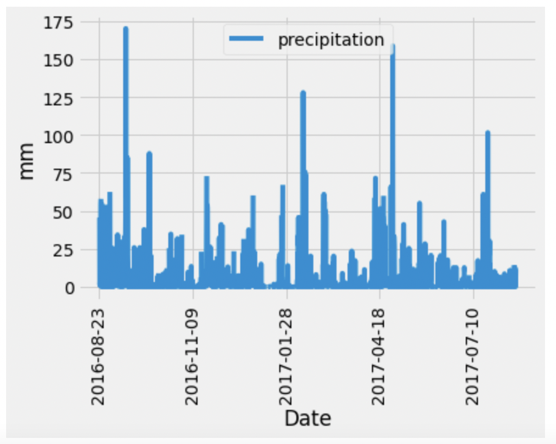
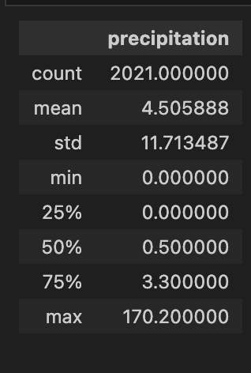
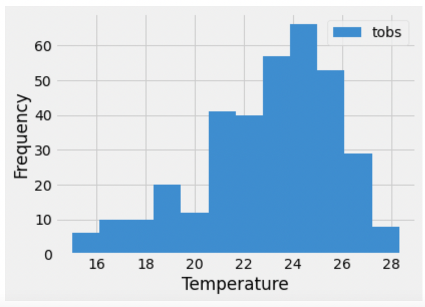

# SQLAlchemy-Challenge :surfer: :palm_tree: 🌊

*In this assignment, I’ll use Python and SQLAlchemy to do a basic climate analysis and data exploration of provided climate database. Specifically, I’ll use SQLAlchemy ORM queries, Pandas, and Matplotlib.*

# Background
Congratulations! You've decided to treat yourself to a long holiday vacation in Honolulu, Hawaii. To help with your trip planning, you decide to do a climate analysis about the area. The following sections outline the steps that you need to take to accomplish this task.

This Challenge is divided into two parts: JupyterNotebook analysis and designing my own Climate App.

## Part 1: Analyse and Explore the Climate Data
I started with importing all the required dependencies.
 
* Created engine using hawaii.sqlite.
* Declared base.
* Used the SQLAlchemy automap_base() function to reflect my tables into classes, and then save references to the classes named station and measurement.
* Linked Python to the database by creating a SQLAlchemy session.
* Performed a precipitation analysis and then a station analysis by completing the steps in the following two subsections.

## Precipitation Analysis
* Found the most recent date in the dataset.
* I used the date to query previous 12 months of preciptation data.
* Selected columns of interest (date and prcp), setting column names, then I sorted the results by date.
* Plotted the results with Matplotlib to illustrate the relationship between two values.

* Created summary statistic table.

## Station Analysis
* Designed a query to calculate total number of stations in the dataset.
* Designed a query to find the most-active stations (that is, the stations that have the most rows) and perfmormed required actions to achieve that result.
* Designed a query to get previous 12 months of temperature observation (TOBS) data and perfmormed required actions to achieve that result.
* Using Matplotlib I created a histogram illustrating the relationship between Temperature and Frequency.

* Closed the session.

## Part 2: Design Your Climate App
1. Imported all the required dependencies.

2. `/` 
Started a homepage.

3. `/api/v1.0/precipitation`
Converted the query results to a dictionary using date as key and prcp as the value.

4. `/api/v1.0/stations`
Returned a JSON list of stations from the dataset.

5. `/api/v1.0/tobs`
Queried the dates and temperature observations of the most-active station for the previous year of data.
Returned a JSON list of temperature observations for the previous year.

6. `/api/v1.0/<start> and /api/v1.0/<start>/<end>`
Returned a JSON list of the minimum temperature, the average temperature, and the maximum temperature for a specified start or start-end range.

For a specified start, calculated TMIN, TAVG, and TMAX for all the dates greater than or equal to the start date.

For a specified start date and end date, calculated TMIN, TAVG, and TMAX for the dates from the start date to the end date, inclusive.

#### Technologies used
* *Visual Studio Code*
* *Excel* 
* *GitHub* 
* **SQLAlchemy**
* *JupyterNotebook*
* *JSON*

#### File list
* Directory "SurfrUp" containing: app.py, climate_analysis.ipynb and Resources Folder with data files.
* Various Screen Shots in ss direcory.
* README.md